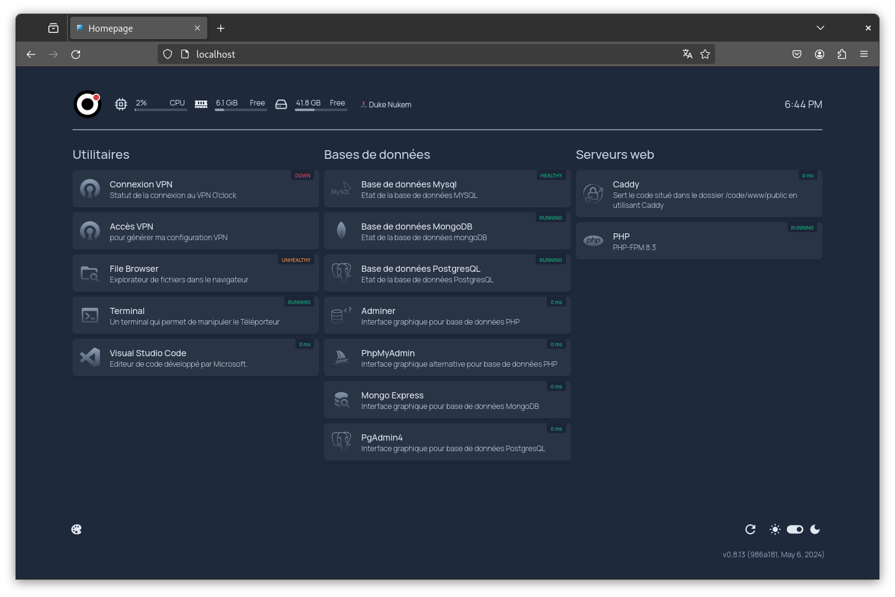

# Teleporter Compose

**Teleporter Compose** is a project that enables easy deployment of development environments using Docker Compose. This repository contains the necessary files to configure and launch multiple Docker containers.



## Prerequisites

- Docker
- Docker Compose [`>=2.20.3`](https://docs.docker.com/compose/multiple-compose-files/include/)

> [!TIP]
> For our educational purposes, we are using [Docker Desktop](https://www.docker.com/products/docker-desktop/), which is available on Linux, macOS (Intel & Apple Silicon chips), and Windows. An alternative could be [Podman Desktop](https://podman-desktop.io/), although it remains untested at the moment.

## Features

This project leverages Docker Compose to manage various applications and services, all of which are accessible via a **centralized homepage at localhost**. This homepage not only provides access to the different web services hosted by the Compose setup but also monitors and displays the status of launched and usable servers (e.g., PHP, MariaDB).

Below is a list of the containers configured for this project, divided into application containers and service containers.

<details>

<summary>Application Containers</summary>

### Application Containers

1. **Dashboard (Homepage)**
    - **Container Name**: `teleporter-homepage`
    - **Image**: `ghcr.io/gethomepage/homepage:latest`
    - **Description**: Provides a central dashboard for the Teleporter system.
    - **Key Features**:
        - Customizable user interface based on environment variables.
        - Integrates with VPN setup.

2. **File Browser**
    - **Container Name**: `teleporter-filebrowser`
    - **Image**: `oclock/teleporter-filebrowser:latest`
    - **Description**: A simple file browser for managing files within the system.
    - **Key Features**:
        - No authentication required.
        - Integrates with local `CODE_DIR`, `DATA_DIR`, and `CONFIG_DIR`.

3. **Terminal**
    - **Container Name**: `teleporter-terminal`
    - **Image**: `oclock/teleporter-terminal:latest`
    - **Description**: Provides terminal access within a web interface.
    - **Key Features**:
        - Supports various environment configurations.
        - Integrates with Docker socket for extended functionalities.

4. **Web Server (Caddy)**
    - **Container Name**: `teleporter-caddyserver`
    - **Image**: `caddy:2.7.6`
    - **Description**: A versatile web server for hosting web applications.
    - **Key Features**:
        - Health checks to ensure server reliability.
        - Customizable through Caddyfile and environment variables.

5. **DBMS Access (Adminer)**
    - **Container Name**: `teleporter-adminer`
    - **Image**: `adminer:4.8.1`
    - **Description**: A database management tool for MariaDB.
    - **Key Features**:
        - Pre-configured with MariaDB settings.
        - Uses Dracula theme for UI.

6. **DBMS Access (PHPmyAdmin)**
    - **Container Name**: `teleporter-phpmyadmin`
    - **Image**: `oclock/teleporter-phpmyadmin:latest`
    - **Description**: Another database management tool, primarily for MySQL/MariaDB.
    - **Key Features**:
        - Configured with root user access.
        - Automatically restarts on failure.

7. **DBMS Access (MongoExpress)**
    - **Container Name**: `teleporter-mongo-express`
    - **Image**: `mongo-express:1.0.2-20-alpine3.19`
    - **Description**: A web-based MongoDB administration interface.
    - **Key Features**:
        - Admin access enabled.
        - Base URL configured for easy access.

8. **VSCode Server**
    - **Container Name**: `teleporter-vscode`
    - **Image**: `linuxserver/code-server:4.21.2`
    - **Description**: A web-based Visual Studio Code instance.
    - **Key Features**:
        - Supports a list of pre-installed extensions.
        - Integrates with local code directory.

</details>

<details>

<summary>Service Containers</summary>

### Service Containers

1. **WireGuard VPN**
    - **Container Name**: `teleporter-vpn`
    - **Image**: `oclock/teleporter-vpn:66b5ee9ca3a7676383cbf4be037bece1d336e23f`
    - **Description**: Provides secure VPN access using WireGuard.
    - **Key Features**:
        - Configurable via `vpn.env`.
        - Health checks to ensure VPN connectivity.

2. **AutoHeal Service**
    - **Container Name**: `teleporter-autoheal`
    - **Image**: `willfarrell/autoheal`
    - **Description**: Monitors and automatically restarts failing containers.
    - **Key Features**:
        - Uses Docker socket for container management.
        - Always restarts on failure.

3. **Reverse Proxy (HAProxy)**
    - **Container Name**: `teleporter-haproxy`
    - **Image**: `haproxy:lts-alpine`
    - **Description**: A high-performance reverse proxy server.
    - **Key Features**:
        - Customizable with HAProxy configuration.
        - Integrates with VPN setup for seamless routing.

4. **DBMS (MariaDB)**
    - **Container Name**: `teleporter-mariadb`
    - **Image**: `mariadb:11.3.2`
    - **Description**: Provides MariaDB database services.
    - **Key Features**:
        - Pre-configured with root password.
        - Health checks to ensure database availability.

5. **DBMS (MongoDB)**
    - **Container Name**: `teleporter-mongodb`
    - **Image**: `mongo:7.0`
    - **Description**: Provides MongoDB database services.
    - **Key Features**:
        - Configured with root user credentials.
        - Integrates with Mongo Express for management.

6. **DBMS (PostgreSQL)**
    - **Container Name**: `teleporter-postgres`
    - **Image**: `postgres:16.2`
    - **Description**: Provides PostgreSQL database services.
    - **Key Features**:
        - Configured with default password.
        - Always restarts on failure.

7. **Node.js Environment**
    - **Container Name**: `teleporter-node`
    - **Image**: `node:20`
    - **Description**: Provides a Node.js runtime environment.
    - **Key Features**:
        - Ports exposed for development.
        - Integrates with local node directory.

8. **PHP Environment**
    - **Container Name**: `teleporter-php`
    - **Image**: `php:8.3-fpm-alpine`
    - **Description**: Provides a PHP runtime environment.
    - **Key Features**:
        - Integrates with local web directory.
        - Supports FPM for fast processing.

9. **Template Config**
    - **Container Name**: `teleporter-templating-config`
    - **Image**: `oclock/teleporter-templating-config:latest`
    - **Description**: Manages templated configurations.
    - **Key Features**:
        - Configurable via environment variables.
        - Integrates with local config directory.

</details>

## Installation

1. Clone the repository to your local machine:
    ```bash
    git clone https://github.com/O-clock-Dev/teleporter-compose.git
    cd teleporter-compose
    ```

2. Start the containers:
    ```bash
    docker compose up
    ```

## Usage

### Starting the Containers

To start the containers, use the following command:
```bash
docker compose up
```

### Stopping the Containers

To stop the containers, use the following command:

```bash
docker compose down
```

### Recreating the Containers

If you need to recreate the containers (for example, after a configuration change), use the following command:

```bash
docker compose up --force-recreate
```

### Project Structure

This repository contains the main configuration and associated files for Docker Compose. The primary `compose.yml` file uses `include` directives to incorporate specific configurations for application containers and services.

- **compose.yml**: Main configuration file for Docker Compose.
    - `include.app.compose.yaml`: Includes descriptions for application containers.
    - `include.svc.compose.yaml`: Includes descriptions for services.
- **code/**: Default directory for your coding files.
- **config/**: Configuration files used for application and service containers.
- **.docker/**: Configuration files used for containers.
- **data/**: Local configuration files for applications.

## Configuration

### Environment Variables

The existing `.env` file contains the following variables to help you customize your experience: `CODE_DIR`, `DATA_DIR`, `CONFIG_DIR`, `LANG`, `TZ`, `WEB_DIR`, `WEB_PUBLIC_DIR`.

### Usage of `.env` File

The `.env` file allows you to configure various aspects of the development and production environment. Here are some examples of what you can do with these variables:

- **AUTOHEAL_CONTAINER_LABEL** and **AUTOHEAL_START_PERIOD**: Configure auto-healing for Docker containers to monitor and automatically restart failing containers.
- **CODE_DIR**: Define the working directory for local code used in the app (e.g., VSCode or Caddy).
- **DATA_DIR**: Define the data folder that contains items like config files or database files that the user won't manipulate directly.
- **LANG** and **TZ**: Set the language and timezone for the containers, which is essential for applications that depend on locale settings.
- **VPN_LOCAL_IP**, **VPN_NETWORK**, **VPN_WILDCARD**, and **VPN_PRIV_IP**: Configure VPN settings to enable secure access to your local network via WireGuard. Requires `vpn.env` to fully function; check the VPN Configuration section.
- **VSCODE_EXTENSIONS_LIST**: Specify a list of Visual Studio Code extensions to install automatically, enhancing the development experience.
- **WEB_DIR** and **WEB_PUBLIC_DIR**: Define directories for web files, making it easier to deploy and manage web applications.

### VPN Configuration

> [!NOTE]
> This configuration is necessary to customize the names displayed on the Teleporter Compose homepage interface.

To access the VPN functionality of the VPN container (WireGuard), you need to generate a `vpn.env` file yourself. Below is an example of what the `vpn.env` file might look like (do not include the actual values or change them):

```bash
FULL_NAME=John Doe
FIRST_NAME=John
LAST_NAME=Doe
PROMO=johnlennon
VPN_NAME=john-doe
KEY_PUB=WGprivatekey
KEY_PRIV=WGpubkey
KEY_VPN_SERVER=WGserverpubkey
IP_PRIV=10.0.0.244
VPN_SERVER=hostnameOrIp
VPN_SERVER_PORT=44222
VPN_LOCAL_PORT=44222
```

> [!CAUTION]
> Ensure that this file is properly configured with your own details and stored securely, as it contains sensitive information needed to establish a secure VPN connection.

## Volumes

Volumes are used to persist data between container restarts. You can configure volumes in the compose files.

## Contribution

Contributions are welcome! Please follow the steps below to contribute:

1. Fork the repository.
2. Create a branch for your feature (git checkout -b feature/my-feature).
3. Commit your changes (git commit -am 'Add a new feature').
4. Push your branch (git push origin feature/my-feature).
5. Open a Pull Request.

## License

This project is licensed under the AGPLv3 License. See the [LICENSE](LICENSE) file for more details.
